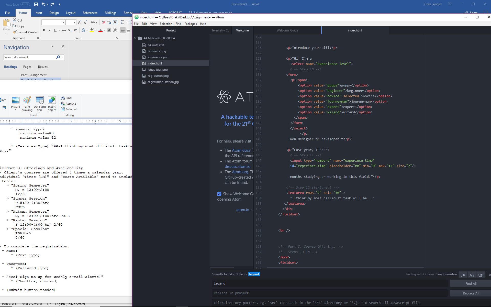

## README ASN4

Alt text is an element that can tell viewers the nature or subject of an image or page

Forms are everywhere, from things like registation to ordering items, calculators or even translation websites.

I enjoyed this assignment as it had me flexing parts of my brain I have not used for a while. I had little problem with this assigment between my minor experience
and the textbook it came down to just going through step by step and checking commands.
The only time I found myself needing a lot of clairification was with the table, and that turned out to be mostly a case of misunderstanding terms.

