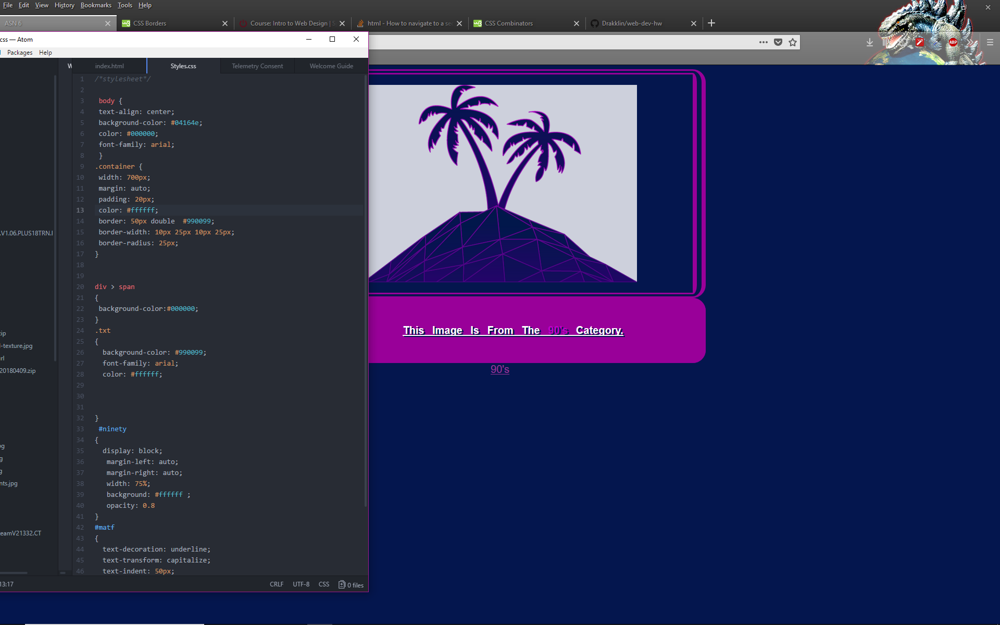

## README Assignment 6

I chose the 90's and the image 1990s-04. I liked the color use and the lines and attempted to extend the feel via the doubled rounded borders, background and text effect.

I chose to use the colors I found inside the image itself and white as it lent itself well to the rest of the projects look. #04164e, #990099, white

The simple truth is that I copied a portion of an old site and modified it to taste, then worked in my div elements and names etc, then checked the appearance on the 800x800 view using a website

