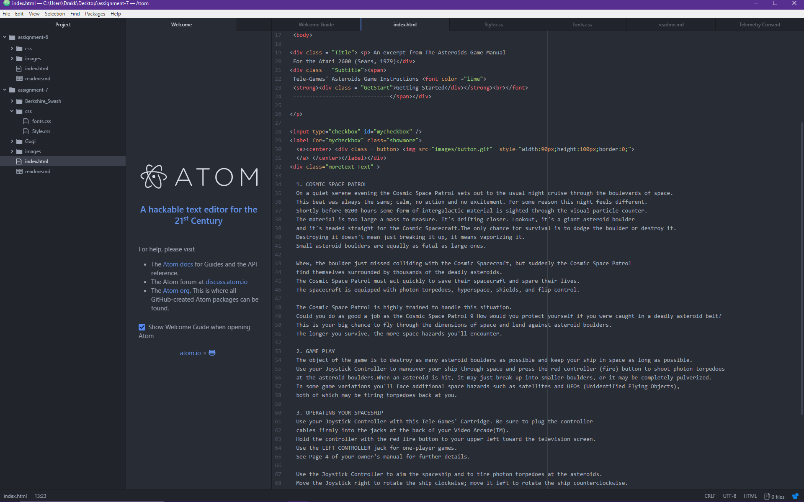

## README Assignment 7

I chose to use a trio of fonts that I felt reminded me of old manuals for various games from my early childhood.
Berkshire Swash really reminds me of text I have seen in ATARI manuals and Gugi really looks like a "space" inspired text.
System fonts are fonts that come pre-installed on your machine with the OS. A web-safe font is any font that can be assumed to be available on basically all systems. The web font is the font coded to be used in a webpage which can only be used if it is available on the computer or hosted if it is unavailable a fallback can be used as indicated or the default for the browser.
As far as work cycle it was a combination of cannibalizing my old work and creating a scheme for my site. Using the new elements and tags especially pseudo was quite a challenge and involved some cussing and ranting but eventually everything folded together with a couple of minor outliers such as not getting my "visited" button to display the changed formatting...no idea why.

