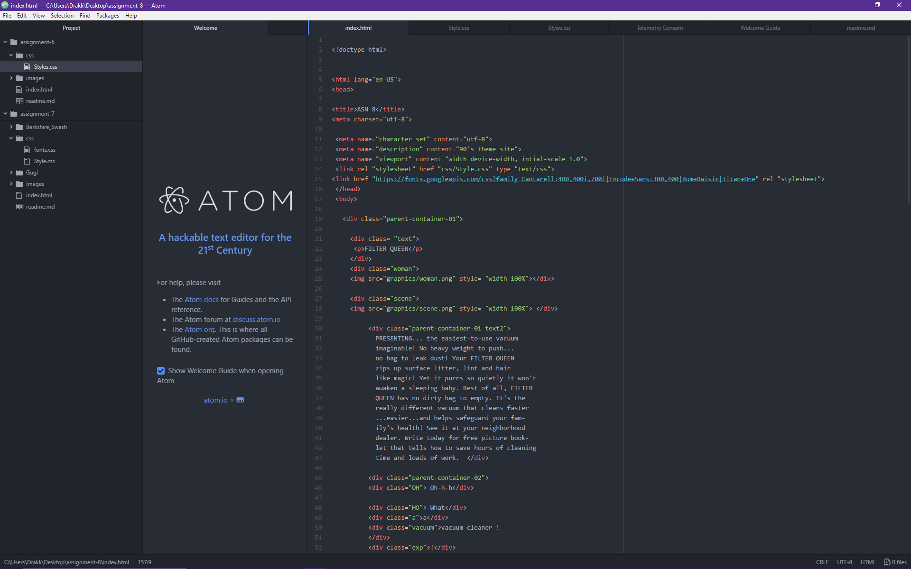

## README Assignment 8

B.) What is the difference between padding, margin, and borders?
padding is space between the content and the border.
border denotes the outside of the content and the margin is usable as a buffer around the border.
C.) The entire project was very challenging and I was not happy with my results.

D.) Basically started strong then re-did the work 100 times before resorting to moving things around until it sort of looked half right.

E.) Embed a screenshot of your workspace at some point during your development cycle.

