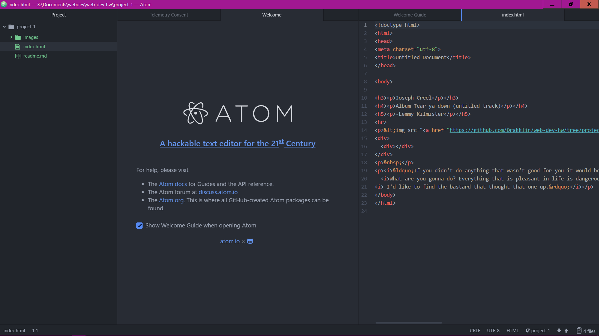

# Project 1 readme "my first website"

Generally I use firefox browser, because I like open source.
Generaly web browsers work on through a client server relationship. The client is run on your computer then when you chose to visit a address
the client reaches out to the web-server associated with that page and retrieves files containing HTML and other programming that are translated into the pages you see.

I visited a version of yahoo.com from 1996. Basically everything has changed, The only techniques I still recognize as existing sites today are the links the title bar and the banner
...oh and the ads.
Their is a lot of white.... backgrounds were white then, but i never noticed how much it hurt the eyes.
The internet was also often localized, and in some cases used a walled garden style infrastructures.

I must admit that after watching the videos the rest was rather easy because I have some experience using Dreamweaver and so a familiarity with HTML.

