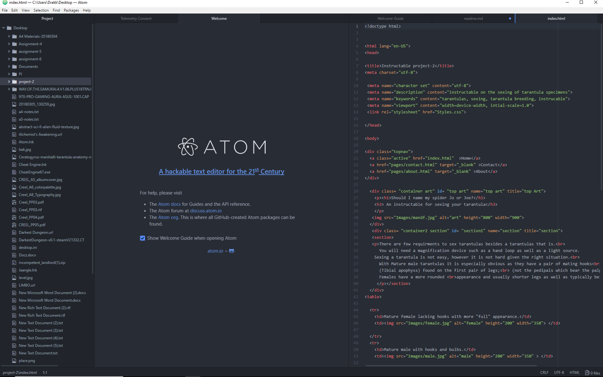

## README ASN5

Div tags are used as a container to help organize an html document. classes are used to refer to CSS code or stylesheet modifications to the HTML. ID tags facilitate the modification of individual elements that may require extra formatting. Spans are used as a form of organization pertaining specifically to inline elements.

Third party hosts are better in quite few ways not limited to being cheaper than self hosted content data and bandwidth wise as well as taking care of maintaining the files and likely backing them up as well. Third party hosting also affords a second location for your content to exist online to be stumbled upon.

This week was kind of tricky. I have worked with html and CSS before but generally using tools like Dreamweaver and such. That said I have done little with making classes, divs, et fully by hand. It thusly required a bit more care and understanding of the content than it sometimes has for me.

